# config-drift-checker

**Your agent conventions are code. This is their CI.** The rules your team taught its coding
agent (`CLAUDE.md` or `AGENTS.md`, skills, hooks) decide how your software gets written now, and
everything underneath them moves without asking: Claude Code alone ships about 25 releases a
month, and the model behind an alias changes server-side with no changelog
([it already has, silently, for weeks](https://www.anthropic.com/engineering/april-23-postmortem)).
This turns those rules into eval cases, runs them on every PR and every release against a pinned
baseline, and tells you the moment something stops working: when, why, and what moved.

**One suite, three agents.** First-class on Claude Code (skills, hooks, release canaries, the
whole drift machinery); the same cases also run through OpenAI's Codex and Google's Gemini CLIs,
with live passing runs on all three, experimental labels on the newer two until full published
comparisons.

[](https://github.com/jameskomo/config-drift-checker/actions/workflows/test.yml)
[](https://github.com/jameskomo/config-drift-checker/releases)
[](https://jameskomo.github.io/config-drift-checker/drift/)

**Proof it works: [we broke our own setup](https://jameskomo.github.io/config-drift-checker/example-break/report.html), and [the repair skill fixed it](https://github.com/jameskomo/config-drift-checker/blob/main/docs/example-break/repair-summary.md).**
A skill's trigger description rewritten the way a careless PR would: the suite fell 1.00 → 0.56,
the tripwire case read 0.00, and the report named the cause itself: the skill was *discovered but
never invoked*, so fix the trigger wording, not the packaging. Then the repair skill restored the
behaviour on its own and proved it with a green re-run, for $0.28. Both artifacts are unedited.



## See it live

| | What you're looking at |
|---|---|
| [**The sabotage report**](https://jameskomo.github.io/config-drift-checker/example-break/report.html) | what a real break looks like: a deliberately broken skill trigger, the tripwire at 0.00, the report naming the cause itself | 
| [**The repair that fixed it**](https://github.com/jameskomo/config-drift-checker/blob/main/docs/example-break/repair-summary.md) | the repair skill's own PR-ready summary from fixing that break live: what drifted, the smallest edit, the green re-run as evidence, $0.28 spent |
| [**The drift observatory**](https://jameskomo.github.io/config-drift-checker/drift/) | this plugin's own suite re-run on every Claude Code release, with a live stability streak, and [a subscribable feed of per-release verdicts](https://jameskomo.github.io/config-drift-checker/drift/feed.xml): the behavioural changelog nobody publishes |
| [**The demo repo**](https://github.com/jameskomo/config-drift-checker-demo) | a small Spring Boot API whose whole setup (cases, config, workflow) was written by `/config-drift-checker:setup` unattended, kept exactly as generated |
| [**The demo's drift index**](https://jameskomo.github.io/config-drift-checker-demo/) | the same observatory for that demo repo, built by its own CI |
| [**What a setup is worth**](docs/community-suites.md) | the first community suite (Spring Boot conventions) with a published with/without measurement: the guard hook is worth +0.75, [the run itself](https://jameskomo.github.io/config-drift-checker/worth/report.html) |
| [**The site**](https://jameskomo.github.io/config-drift-checker/) | one page with all of the above |

## Quick start

One command in the repo whose setup you want protected:

```bash
claude plugin marketplace add jameskomo/config-drift-checker && claude plugin install config-drift-checker@jameskomo && claude "/config-drift-checker:setup"
```

Five minutes: it finds your CLAUDE.md, skills and hooks, writes starter eval cases from them,
smoke-runs them, and writes `.cdc.yml` plus the GitHub workflow. Prefer never opening Claude at
all? `node <plugin-root>/tools/cdc-bootstrap.mjs .` runs the same setup headlessly, and
`--no-agent` scaffolds everything for $0 (blank starter case included) so you fill in the prompts
yourself. Add one secret
(`CLAUDE_CODE_OAUTH_TOKEN` from `claude setup-token` to run free on a Pro/Max subscription, or
`ANTHROPIC_API_KEY`), push, done.

Already have a suite in the `claude plugin eval` format? One step:

```yaml
- uses: jameskomo/config-drift-checker/action@v1
  with: { plugin-dir: . }
```

(`@v0` keeps working; both moving tags point at the same latest release.)

## What you get

Every row is shipped and tested; where a public receipt exists, it's linked.

**Detect** — know the moment behaviour moves

| | |
|---|---|
| Pinned baseline + canary | the baseline never moves under you; the canary tests each new Claude Code release and alias model before your team meets it |
| Noise bands with guards | each case's allowed wobble is learned from its own history; a real break can't hide in the band (no recovering run, or a persisting drop, stays red) |
| Refusal labels | a model guardrail change is labelled a refusal, never blamed on your setup |
| Discovered vs invoked | a red skill case says which repair it needs: fix the trigger wording, or fix the packaging — [watch it self-diagnose a real break](https://jameskomo.github.io/config-drift-checker/example-break/report.html) |
| Efficiency drift | slower, pricier, longer gets flagged even when every case still passes |
| Coverage | which of your rules have no test: a percentage, a badge, and a `coverage-min` gate |

**Diagnose** — red comes with answers, not homework

| | |
|---|---|
| Reports that show their work | every report lists the whole suite including skipped cases, every discovered skill and whether it fired, and exactly which checks ran beyond a bare `claude plugin eval` |
| `drift-bisect` | a case passed weeks ago and fails today: binary-search the Claude Code releases in between, log2(N) runs, get the culprit version and the bug-report sentence |
| `trace-keeper` | preserves the official runner's transcripts, which it otherwise deletes on exit |
| What a setup is worth | the same tasks with and without your setup, published: [the guard hook measures +0.75](https://jameskomo.github.io/config-drift-checker/worth/report.html) |

**Repair** — and prove the fix

| | |
|---|---|
| Autonomous repair | on red, the smallest setup edit that restores the behaviour, verified by re-running the failing cases — [a real repair, $0.28, first attempt green](https://github.com/jameskomo/config-drift-checker/blob/main/docs/example-break/repair-summary.md) |
| Bump and pin PRs | two proven-green canaries open the PR that moves your pins, evidence attached, never auto-merged |

**Operate** — it runs itself, and reports to you

| | |
|---|---|
| The observatory | stat tiles, a stability streak, and a verdict timeline per Claude Code release — [ours, live](https://jameskomo.github.io/config-drift-checker/drift/) |
| The drift wire | [a subscribable Atom feed](https://jameskomo.github.io/config-drift-checker/drift/feed.xml) plus `verdicts.json`: one behavioural verdict per release, the changelog nobody else publishes |
| The status badge | embeddable like a coverage badge: green "cc2.1.269 · 3 releases clean", red naming the version the day something breaks |
| Digest and post, pre-written | every publish regenerates a weekly digest and [the release announcement ready to paste](https://jameskomo.github.io/config-drift-checker/drift/post.txt); a workflow can post it to Bluesky/Mastodon automatically |
| Hard budget caps | per run and per month, enforced from a ledger; $0 API on a Claude Pro/Max subscription token |
| One-command onboarding | `cdc-bootstrap` runs the whole setup headlessly with an auth preflight, or scaffolds everything for $0 with `--no-agent` |
| Fleet + org rollout | one dashboard and pin policy across every repo, and a reusable org workflow that installs the check with a three-line caller — no hosted server, ever |
| Community suites | maintained setups with published worth numbers ([Spring Boot first](docs/community-suites.md)); a [hosted-tier waitlist](https://github.com/jameskomo/config-drift-checker/issues/new?template=hosted-waitlist.yml) decides what we run for you |

**Across agents** — one suite, three CLIs

| | |
|---|---|
| Claude Code | first-class: skills, hooks, plugins, release canaries, the whole drift machinery |
| Codex (experimental) | `--agent codex` with `AGENTS.md` bridging; live-calibrated on a ChatGPT plan |
| Gemini (experimental) | `--agent gemini` with `GEMINI.md` bridging; live run scored 1.00 on the free Google tier |

## How this relates to `claude plugin eval`

Claude Code ships an eval runner, and it's good: it runs your cases, grades them, generates
starter cases with `init`, and writes a report. We build on it, not beside it: cases are in that
exact format, the Action prefers the official runner (bundled fallback for older versions), and a
`claude plugin eval . --json out.json` result feeds our diff, report and drift index directly.

| | `claude plugin eval` (built in) | config-drift-checker |
|---|---|---|
| Run cases, grade, report on one run | yes, it's the runner we build on | uses it |
| Generate starter cases | `init` | `/config-drift-checker:setup`, same format |
| A stored baseline to diff against | no, you compare runs by eye | pinned baseline, promoted deliberately |
| History across releases | no, the docs advise pinning your model | every run kept; a drift index over every version |
| Flake vs break | no, a noisy case just fails sometimes | per-case noise bands with anti-masking guards |
| Watching Claude Code and model releases | no | release watch + canary, throttled by your budget |
| Pin bump PRs | no | two green canaries open a PR with evidence |
| Red check, PR comment, Slack | exit code | all three |
| Spend control | a per-run ceiling flag | per-run and per-month caps, enforced from a ledger |
| Coverage of your rules | no | percent, badge, `coverage-min` gate |
| Repair proposal on red | no | a PR with the smallest fix, [proven live](https://github.com/jameskomo/config-drift-checker/blob/main/docs/example-break/repair-summary.md) |
| Why a skill case failed | a score | discovered vs invoked: trigger wording or packaging |
| Transcripts | deleted when the command exits | `trace-keeper` copies them next to the JSON |

One sentence: their command answers "does my plugin work right now on my machine"; this answers
"did anything stop working since the baseline, across every release, without me watching".

## Trust

**Stable since v1.0**: the `v0`/`v1` moving tag never breaks your workflow; breaking changes mean
a new major with an upgrade note in [CHANGELOG.md](CHANGELOG.md).
Zero npm dependencies (Node builtins only), 96 tests that run against a fake `claude` with no API
key, every third-party action pinned to a verified commit SHA, CodeQL on every push. Runs on your
runner with your key; nothing is sent to us, because there is no us to send it to. Details in
[docs/security.md](docs/security.md).

## What's here

```
config-drift-checker/   the plugin: skills (setup · run · write-case · repair) + the tools
  tools/                shim runner · diff · classify · report · dashboard · coverage · watch · gate · promote · trace-keeper · fleet · bootstrap · drift-bisect · drift-digest
  test/                 node --test suite, fake claude, npm test
action/                 composite GitHub Action: gate → run → diff → store → PR → repair → alert
examples/komo-stack/    a full example suite with .cdc.yml and baseline results
docs/                   user guide · architecture · eval format & runner · runbook · security
```

## Hosted tier (waitlist)

Self-hosting is free forever, that never changes. A managed tier (we run the canaries, fleet
dashboards and alerts; you get the PRs and the pages) gets built when enough teams want it:
[join the waitlist](https://github.com/jameskomo/config-drift-checker/issues/new?template=hosted-waitlist.yml),
two questions, no commitment. [Discussions are open](https://github.com/jameskomo/config-drift-checker/discussions)
for everything else.

## Documentation

Start with the [user guide](docs/user-guide.md) (`.cdc.yml` reference [here](docs/user-guide.md#cdcyml)); full index in [docs/](docs/README.md).

## Licence

[FSL-1.1-Apache-2.0](LICENSE): free to use, modify and self-host; not to be offered as a competing
commercial service; each release becomes Apache-2.0 two years after publication.
