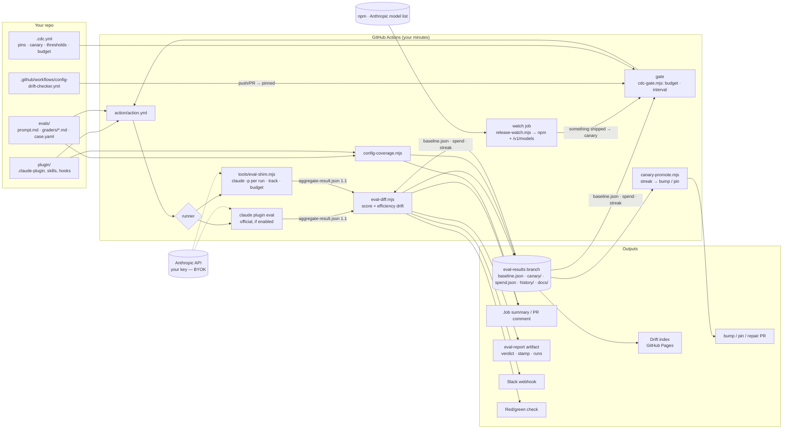

# Architecture

## Overview — GitHub Action, no backend

**Components**

| Component | Responsibility | State |
|---|---|---|
| `cdc-config.mjs` | read `.cdc.yml`: resolve a track (model, harness, runs, expansion, thresholds, fail_on, budget); rewrite pins in place | `.cdc.yml` in the repo |
| `release-watch.mjs` | did Claude Code (npm) or the model list (`/v1/models`) move since last time; is the pin still listed | `.release-watch.json` on results branch |
| `cdc-gate.mjs` | refuse a run past the monthly budget or sooner than the canary interval; record spend after a run | `spend.json`, `canary/streak.json` on results branch |
| `action.yml` | config → coverage → results → gate → install pinned Claude Code → detect runner → run → diff → report → store → PR → repair → notify → exit | none (stateless per run) |
| `eval-shim.mjs` | execute a suite: isolated `CLAUDE_CONFIG_DIR`, throwaway workspace, `--plugin-dir`, per-case tools, N runs × arms with sequential expansion and a per-run budget; grade; emit JSON 1.1 with provenance | temp dirs only |
| `eval-diff.mjs` | baseline vs current → score drift and efficiency drift → markdown + JSON + exit code by `fail_on` | none |
| `canary-promote.mjs` | green streak on the same model+version → bump decision; unpinned green pinned run → pin decision; PR title/body | `canary/streak.json` |
| `config-coverage.mjs` | rules in CLAUDE.md / skills / hooks vs the cases' `covers:` → coverage JSON, markdown, badge | `coverage.json` |
| `eval-report.mjs` | aggregate-result.json (+ baseline) → self-contained HTML report | none |
| `eval-dashboard.mjs` | history (+ baseline, spend, streak, coverage) → the drift index | none |
| results branch | history, baseline, ledger, streak, dashboards — without a database | git |

**Trust boundaries**

- Your API key never leaves your CI (env → `claude`). We see nothing. The only outbound calls the
  tools make themselves are `npm view` and `GET /v1/models` with your key (the watch job).
- Prompts, transcripts, and files created by the agent stay in your runner and results
  branch (you choose whether that branch is in a private repo).
- The action runs `case.yaml` `scaffold_script` only when `scaffold: true` — same gate as the
  official runner; never run suites you didn't author with scaffold on.
- PRs the Action opens (bump, pin, repair) are never auto-merged and need the repo to allow Actions
  to create PRs; otherwise the branch is pushed and a warning tells you to open it.

## Two tracks

| | pinned | canary |
|---|---|---|
| model | `model.pinned` — an exact id | `model.canary` — an alias, resolved at run time |
| Claude Code | `harness.pinned` | `latest` |
| when | push/PR to the setup, manual | schedule, only when npm or the model list moved, at most every `min_interval_hours` |
| runs | case default (3) | 1, +2 on deviation |
| compared to | `baseline.json` | `baseline.json` |
| on red | check red, PR comment, Slack | Slack, summary, dashboard *canary red*; check of its own run red; **baseline untouched** |
| writes | `baseline.json` (first run / promote) | `canary/latest.json`, `canary/streak.json` |
| opens | *pin PR* when no pin is declared | *bump PR* after `promote_after` greens on a new pair |

## Data flow of one run

1. Trigger: push / PR → pinned; schedule + release-watch change → canary; manual → chosen.
2. `config`: resolve the track from `.cdc.yml`. `coverage`: rules vs cases (no agent runs).
3. `results`: fetch `baseline.json`, `spend.json`, `canary/streak.json` from the results branch.
4. `gate`: budget and interval → run, or skip with a notice (exit 0).
5. `install`: the track's Claude Code version. `runner`: official if enabled, else shim.
6. `run`: for each case × run (× arm): scaffold workspace → spawn agent → capture trace; grade
   (regex / tool_used / file_exists / llm); expand on deviation; stop at the per-run budget.
7. `diff`: score and efficiency drift vs baseline; `fail_on` decides red. `report`: HTML.
8. `store`: history, baseline or canary/latest, ledger, release-watch state, streak + bump/pin decision,
   coverage, docs; one commit on the results branch.
9. `pr`: open the bump/pin PR from a worktree if one is due and none is open. `repair` (opt-in, red only):
   the repair skill proposes a setup fix, verifies it under the remaining budget, PR.
10. `comment` / `slack` / `gate-exit`: PR comment, alert, check status.

## Non-goals

Testing the model's general quality; hosting your repos; replacing `claude plugin eval` (we wrap it);
a DSL of our own (Anthropic's format is the interface); auto-merging anything.
