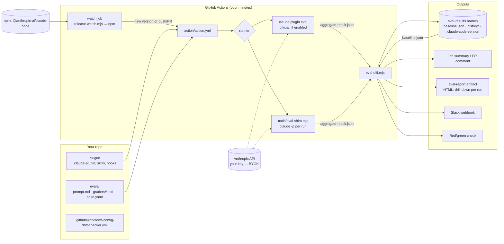

# Architecture

## Overview — GitHub Action, no backend

**Components**

| Component | Responsibility | State |
|---|---|---|
| `release-watch.mjs` | poll npm for a new Claude Code version vs the stored one | `.claude-code-version` on results branch |
| `action.yml` | install pinned Claude Code, detect gate, run, diff, store, notify, gate | none (stateless per run) |
| `eval-shim.mjs` | execute a suite: isolated `CLAUDE_CONFIG_DIR`, throwaway workspace, `--plugin-dir`, per-case tools, N runs × arms; grade; emit official JSON | temp dirs only |
| `eval-diff.mjs` | baseline vs current → markdown + JSON + exit code | none |
| `eval-report.mjs` | aggregate-result.json (+ baseline) → self-contained HTML report; uploaded as a workflow artifact | none |
| results branch | history without a database | git |

**Trust boundaries**

- Your API key never leaves your CI (env → `claude`). We see nothing in v0.1.
- Prompts, transcripts, and files created by the agent stay in your runner and results
  branch (you choose whether that branch is in a private repo).
- The action runs `case.yaml` `scaffold_script` only when `scaffold: true` — same gate as the
  official runner; never run suites you didn't author with scaffold on.

## Data flow of one regression run (either version)

1. Trigger: new npm version / cron / push / PR / manual.
2. Resolve suite: load `evals/**/prompt.md`, `graders/*.md`, `case.yaml`.
3. For each case × run (× arm): scaffold workspace → spawn agent with plugin → capture trace.
4. Grade: regex / tool_used / file_exists / llm (judge model) → per-run score.
5. Aggregate → `aggregate-result.json` (schemaVersion 1).
6. Diff against baseline → per-case status (regressed / stable / improved / new / missing).
7. Store history; promote baseline if requested; notify; set check status.

## Non-goals

Testing the model's general quality; hosting your repos; replacing `claude plugin eval` (we wrap it);
a DSL of our own (Anthropic's format is the interface).
